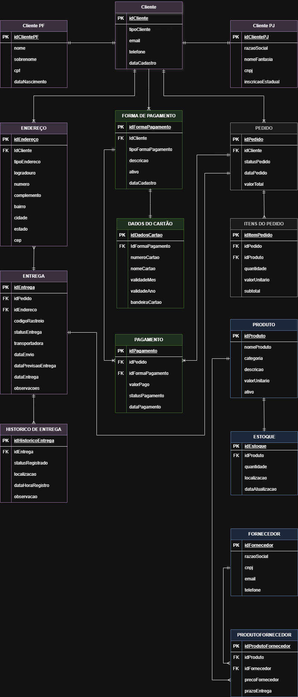

# Desafio de Modelagem de BD para E-commerce - Bootcamp DIO

Projeto desenvolvido para o desafio de modelagem de banco de dados do **Bootcamp GenAI & Dados da DIO em parceria com o Bradesco**.

## 👨‍💻 Analista
- **Nome:** Lucas Santos
- **LinkedIn:** [Linkedin (https://www.linkedin.com/in/lucas-santos-3ab322294/)]

---

## 📊 Diagrama Entidade-Relacionamento (DER)

A imagem abaixo representa o esquema do banco de dados relacional projetado para o sistema de e-commerce.

---

### 🛠️ Tecnologias e Ferramentas
- **Modelagem:** Draw.io (diagrams.net)
- **Banco de Dados (SQL):** MySQL
- **Versionamento:** Git & GitHub
